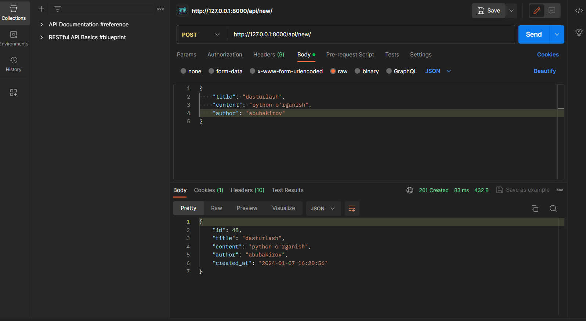
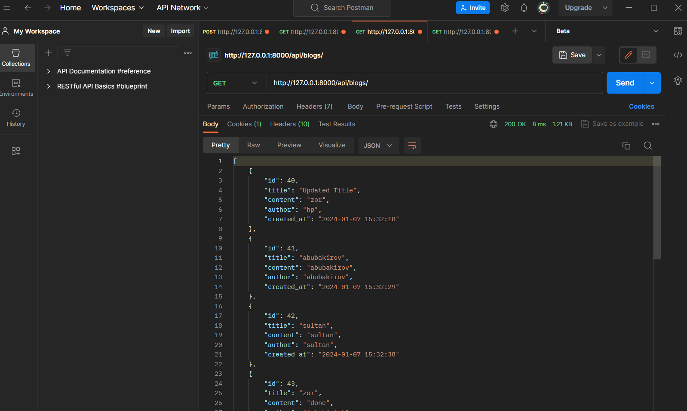
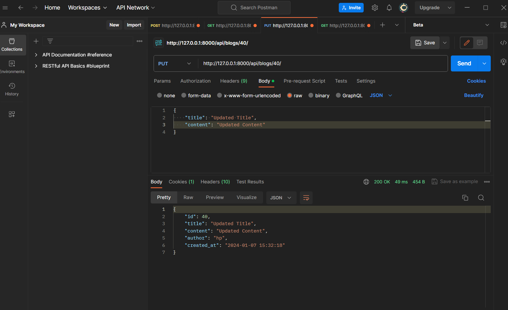
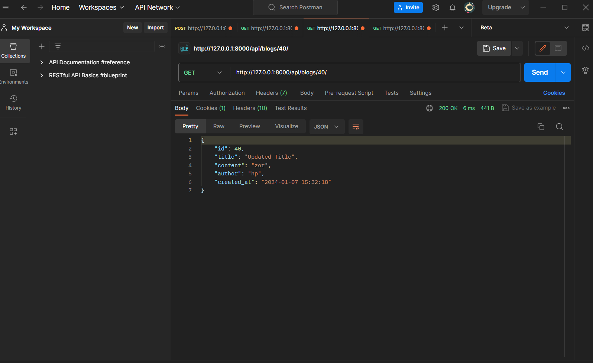
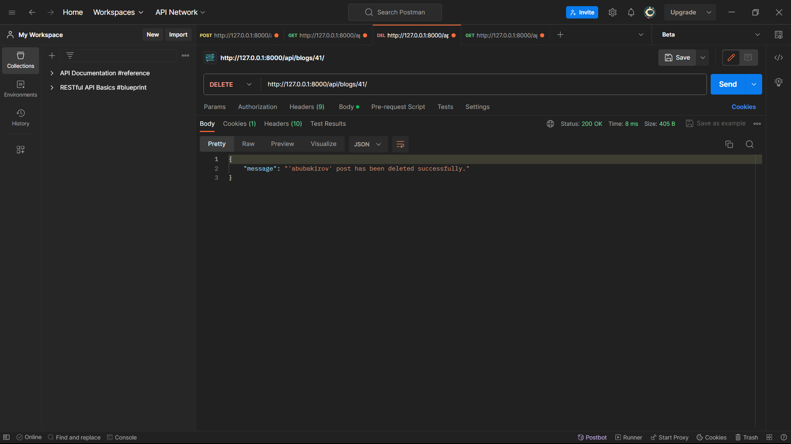
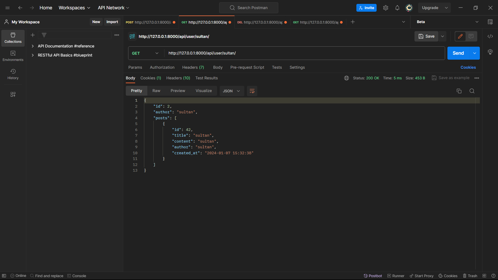

# Blog App RESTful API Documentation
<<<<<<< HEAD
=======
Bu dokumentatsiya Blog App RESTful API uchun tuzilgan. Ushbu API orqali bloglar yaratish, o'qish, yangilash va o'chirish mumkin.
> Avvalo admin panekdan user yaratib oling! agar erinsangiz <author> o'zingizga yoqqan usernamengizni yozsangiz avtomatik user yaratadi )
>>>>>>> 904d3889af48ac901cc244b0c0efa4c37d6a5bc9
```bash
git clone https://github.com/abubakirovxolmirza/BlogApi
```
```bash
docker buld -t blog:1.0
```

## Blog Model

- `title` (string): Blog ning nomi.
- `content` (text): Blog ning tavsifi.
- `created_at` (datetime): Blog yaratilgan vaqti.
- `author` (string): Blog ni yaratgan foydalanuvchining usernamesi.

## HTTP So'rovlari va Javoblari

## Yangi blog post yaratish

## Barcha blog postlar ro’yxatini ko’rsatish

## {id} li blog postni yangilash

## {id} li blog postni qaytarish

## {id} li blog postni o’chirish

## {username} li odamni profilini ko’rsatish

<<<<<<< HEAD
=======
### `POST /api/blogs/`


=======
+ modelsga test yozilgan.
>>>>>>> 904d3889af48ac901cc244b0c0efa4c37d6a5bc9
